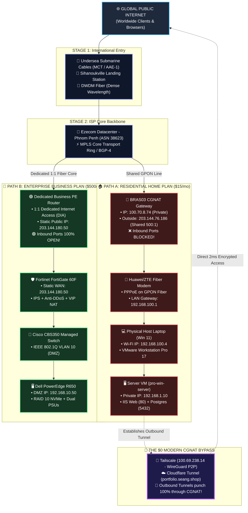

# Cambodia Internet Architecture & Enterprise Public Hosting Guide

**Royal University of Phnom Penh (RUPP) — Department of Computer Science**  
**Course:** Windows Server Administration & Enterprise Network Infrastructure  
**Author:** IT Systems Engineering Lab Note  
**Target Server:** pro-win-server (WIN-J17IMHCEMA9 / 192.168.1.10 / Windows Server 2022)  
**Real-World Context:** Ezecom Fiber ISP, Carrier-Grade NAT (CGNAT), Submarine Cables, and Modern Cloud Ingress  

---

## 📖 Table of Contents

1. [Executive Overview & Visual Architecture](#1-executive-overview--visual-architecture)
2. [Master Visual Flowchart (Mermaid Diagram)](#2-master-visual-flowchart-mermaid-diagram)
3. [The 5-Stage Step-by-Step Architecture Diagram (ASCII)](#3-the-5-stage-step-by-step-architecture-diagram-ascii)
4. [In-Depth Stage-by-Stage Technical Breakdown](#4-in-depth-stage-by-stage-technical-breakdown)
   - [Stage 1: International Submarine Fiber Landing (Sihanoukville)](#stage-1-international-submarine-fiber-landing-sihanoukville)
   - [Stage 2: ISP Core Backbone & Phnom Penh City Ring (MPLS)](#stage-2-isp-core-backbone--phnom-penh-city-ring-mpls)
   - [Stage 3: ISP Gateway Divergence (CGNAT BRAS vs. Dedicated DIA PE)](#stage-3-isp-gateway-divergence-cgnat-bras-vs-dedicated-dia-pe)
   - [Stage 4: Perimeter Hardware (Home ONT Modem vs. Fortinet NGFW)](#stage-4-perimeter-hardware-home-ont-modem-vs-fortinet-ngfw)
   - [Stage 5: Server Compute & Storage (VMware VM vs. Dell PowerEdge Rack)](#stage-5-server-compute--storage-vmware-vm-vs-dell-poweredge-rack)
5. [Why Traditional Port Forwarding Fails on Residential Fiber](#5-why-traditional-port-forwarding-fails-on-residential-fiber)
6. [The $0 Modern Solution: Outbound Zero-Trust Tunnels (Tailscale & Cloudflare)](#6-the-0-modern-solution-outbound-zero-trust-tunnels-tailscale--cloudflare)
7. [Comprehensive Technology & Protocol Stack Table](#7-comprehensive-technology--protocol-stack-table)
8. [University Oral Defense Presentation Script (30-Second Pitch)](#8-university-oral-defense-presentation-script-30-second-pitch)

---

## 1. Executive Overview & Visual Architecture

In modern computer networking, connecting a server to the public Internet depends heavily on the **type of ISP contract** and **underlying network routing topology**.

In Cambodia, internet traffic follows two fundamentally different paths:
1. **The Residential Home Path ($15 – $25/month):** Uses **Carrier-Grade NAT (CGNAT / RFC 6598)** where one public IP is shared among hundreds of households. Inbound ports are strictly blocked by the ISP's gateway router.
2. **The Enterprise Business Path ($200 – $1,000/month):** Uses **Dedicated Internet Access (DIA)** with a dedicated **Static Public IPv4 address** and perimeter hardware firewalls (Fortinet FortiGate), allowing unrestricted inbound hosting.

---

## 2. Master Visual Flowchart (Mermaid Diagram)



---

## 3. The 5-Stage Step-by-Step Architecture Diagram (ASCII)

```text
==========================================================================================================================================================
                                       CAMBODIA COMPLETE NETWORK ARCHITECTURE & INGRESS COMPARISON
==========================================================================================================================================================

                                                   🌐 THE GLOBAL PUBLIC INTERNET (Worldwide Clients & Browsers)
                                                                                  │
                                ┌─────────────────────────────────────────────────┴─────────────────────────────────────────────────┐
                                │                                                                                                   │
                                ▼                                                                                                   ▼
 ╔══════════════════════════════════════════════════════════════════════════════════════════════════════════════════════════════════════════════════════╗
 ║ [STAGE 1: INTERNATIONAL SUBMARINE GATEWAY] 🌊 Sihanoukville Landing Station (MCT & AAE-1 Submarine Cables)                                            ║
 ║ • Physical Medium: Undersea Fiber Optic Cable using DWDM (Dense Wavelength Division Multiplexing)                                                      ║
 ║ • Global Routing Protocol: BGP-4 (Border Gateway Protocol / RFC 4271) under Ezecom Autonomous System (ASN 38623)                                      ║
 ╚══════════════════════════════════════════════════════════════════════════════════════════════════════════════════════════════════════════════════════╝
                                │                                                                                                   │
                                ▼ (High-Speed City Fiber Ring: MPLS Transport / RFC 3031 along National Road 4)                     ▼
 ╔══════════════════════════════════════════════════════════════════════════════════════════════════════════════════════════════════════════════════════╗
 ║ [STAGE 2: EZECOM CENTRAL DATACENTER - PHNOM PENH] 🏢 Carrier Core Routing & Switching Infrastructure                                                  ║
 ╚══════════════════════════════════════════════════════════════════════════════════════════════════════════════════════════════════════════════════════╝
                                │                                                                                                   │
════════════════════════════════╪═══════════════════════════════════════════════════════════════════════════════════════════════════╪══════════════════
 🏠 PATH A: RESIDENTIAL HOME FIBER (/month)                                                                                       🏢 PATH B: ENTERPRISE BUSINESS FIBER ( - ,000/month)
════════════════════════════════╪═══════════════════════════════════════════════════════════════════════════════════════════════════╪══════════════════
                                │                                                                                                   │
                                ▼                                                                                                   ▼
 ┌─────────────────────────────────────────────────────────────┐                                     ┌─────────────────────────────────────────────────────────────┐
 │ [STAGE 3: CARRIER-GRADE NAT (CGNAT)] 🛑                     │                                     │ [STAGE 3: DEDICATED BUSINESS PE ROUTER] 🟢                  │
 │ • Engine: BRAS03-EZECOM-CCC (Huawei ME60 / Cisco ASR)       │                                     │ • Service: DIA (Dedicated Internet Access / 1:1 Contention) │
 │ • IP Standard: RFC 6598 (Shared Carrier Address Space)      │                                     │ • IP Standard: RFC 791 Static Public IPv4 Allocation        │
 │ • Assigned WAN IP: 100.70.8.74 / Subnet: 255.255.255.255    │                                     │ • Assigned Static IP: 203.144.180.50 (Dedicated CIDR /29)  │
 │ • Outside Public IP: 203.144.76.186 (Shared by 500 houses!) │                                     │ • SLA Guarantee: 99.9% Uptime with 0% Packet Loss           │
 │ • ❌ INBOUND TRAFFIC: DROPPED & BLOCKED BY DEFAULT!          │                                     │ • 🟢 INBOUND TRAFFIC: 100% UNBLOCKED & DIRECT!              │
 └──────────────────────────────┬──────────────────────────────┘                                     └──────────────────────────────┬──────────────────────────────┘
                                │                                                                                                   │
                                │ (Shared GPON Fiber Cable / ITU-T G.984)                                                           │ (Dedicated 1:1 Dark Fiber Core / Single-Mode OS2)
                                ▼                                                                                                   ▼
 ┌─────────────────────────────────────────────────────────────┐                                     ┌─────────────────────────────────────────────────────────────┐
 │ [STAGE 4: RESIDENTIAL FIBER MODEM] 📡                       │                                     │ [STAGE 4: NEXT-GENERATION FIREWALL (NGFW)] 🛡️               │
 │ • Hardware: Huawei HG8145V5 / ZTE F660 ONT                  │                                     │ • Hardware: Fortinet FortiGate 60F (FortiOS 7.x)            │
 │ • Protocol: PPPoE Client (Point-to-Point over Ethernet)     │                                     │ • Static WAN Interface: 203.144.180.50 (Port 80/443/5432)   │
 │ • LAN Gateway IP: 192.168.100.1                             │                                     │ • Active Security: IPS, Anti-DDoS, SSL Inspection, Antivirus│
 │ • Limitation: Port Forwarding fails due to CGNAT Hop #3!    │                                     │ • Network Feature: Virtual IP (VIP) & NAT Port Forwarding   │
 └──────────────────────────────┬──────────────────────────────┘                                     └──────────────────────────────┬──────────────────────────────┘
                                │                                                                                                   │
                                │ (Gigabit Ethernet / Wi-Fi 5 802.11ac)                                                             │ (SFP+ 10-Gigabit Trunk / IEEE 802.1Q VLAN Tagging)
                                ▼                                                                                                   ▼
 ┌─────────────────────────────────────────────────────────────┐                                     ┌─────────────────────────────────────────────────────────────┐
 │ [STAGE 5: PHYSICAL HOST LAPTOP] 💻                          │                                     │ [STAGE 5: ENTERPRISE MANAGED SWITCH] 🔌                     │
 │ • OS: Windows 11 Physical Machine                           │                                     │ • Hardware: Cisco Business CBS350-24T / Catalyst Switch     │
 │ • Physical Wi-Fi IP: 192.168.100.4                          │                                     │ • Network Segmentation: VLAN 10 (DMZ Public Web Servers)    │
 │ • Hypervisor: VMware Workstation Pro 17                     │                                     │ • Security: Port Security, Broadcast Storm Control, LACP    │
 └──────────────────────────────┬──────────────────────────────┘                                     └──────────────────────────────┬──────────────────────────────┘
                                │                                                                                                   │
                                │ (VMware Virtual Switch: VMnet8 NAT / 192.168.1.0/24)                                              │ (Cat6A Shielded Twisted Pair Ethernet)
                                ▼                                                                                                   ▼
 ┌─────────────────────────────────────────────────────────────┐                                     ┌─────────────────────────────────────────────────────────────┐
 │ [STAGE 5.2: VIRTUAL SERVER ON-PREMISE] 🖥️                  │                                     │ [STAGE 5.2: ENTERPRISE PHYSICAL RACK SERVER] 🖥️             │
 │ • VM Name: pro-win-server (Windows Server 2022 Standard)    │                                     │ • Hardware: Dell PowerEdge R650 Rack Server (2U Enterprise) │
 │ • Local Private IP: 192.168.1.10                            │                                     │ • Internal IP: 192.168.10.50 (Isolated in DMZ VLAN 10)      │
 │ • Active Services: IIS Web (80), PostgreSQL (5432), Oracle  │                                     │ • Reliability: Dual Intel Xeon, 128GB ECC RAM, Dual PSUs    │
 │                                                             │                                     │ • Storage: 4x 1.92TB NVMe SSDs in Hardware RAID 10 Array    │
 │ 🌟 THE  MODERN CGNAT BYPASS WEAPONS:                      │                                     │ • Power Protection: APC Smart-UPS 2200VA (0ms Transfer Time)│
 │ • 🦎 Tailscale IP: 100.69.238.14 (WireGuard Mesh Tunnel)    │                                     │                                                             │
 │ • ☁️ Cloudflare Tunnel: portfolio.seang.shop (QUIC HTTP/3)   │                                     │ 🟢 ACCESSIBILITY:                                           │
 │ 👉 Outbound tunnels punch 100% through BRAS03 with  fee!  │                                     │ 👉 Direct Public Access via http://203.144.180.50           │
 └─────────────────────────────────────────────────────────────┘                                     └─────────────────────────────────────────────────────────────┘
==========================================================================================================================================================
`

---

## 4. In-Depth Stage-by-Stage Technical Breakdown

### Stage 1: International Submarine Fiber Landing (Sihanoukville)
* **Physical Medium:** Undersea fiber optic cables connecting Cambodia across international waters.
* **Key Cable Systems:**
  * **MCT Cable (Malaysia-Cambodia-Thailand):** 1,300 km subsea cable landing at Sihanoukville, operated by Telcotech/Ezecom.
  * **AAE-1 (Asia-Africa-Europe 1):** 25,000 km subsea cable linking Asia to Europe.
* **Optics Technology:** **DWDM (Dense Wavelength Division Multiplexing)** multiplexes hundreds of laser wavelengths over a single optical strand, achieving multi-terabit bandwidth.
* **Global Routing Protocol:** **BGP-4 (Border Gateway Protocol / RFC 4271)** exchanges routing paths between Ezecom's Autonomous System (**ASN 38623**) and tier-1 international carriers.

---

### Stage 2: ISP Core Backbone & Phnom Penh City Ring (MPLS)
* Optical laser signals travel from Sihanoukville to Phnom Penh along National Road 4.
* Inside Phnom Penh, Ezecom operates a high-speed core fiber ring utilizing **MPLS (Multiprotocol Label Switching / RFC 3031)** to achieve sub-millisecond packet switching across carrier datacenters.

---

### Stage 3: ISP Gateway Divergence (CGNAT BRAS vs. Dedicated DIA PE)

#### 🏠 Path A (Residential Home Plan - /mo):
* **BRAS / BNG:** Traffic is routed through **BRAS03-EZECOM-CCC** (*Broadband Remote Access Server*).
* **PPPoE Authentication:** The modem authenticates with Ezecom's RADIUS server.
* **Carrier-Grade NAT (CGNAT / RFC 6598):** Ezecom assigns a private IP from the shared block **100.64.0.0/10** (specifically **100.70.8.74**).
* **The 500:1 Sharing Ratio:** 500 neighborhood houses share **one single public IP (203.144.76.186)**.
* 🛑 **The Inbound Block:** Unsolicited incoming connection requests (port scans, web visitors) are destroyed at BRAS03 because the router does not know which house the packet belongs to!

#### 🏢 Path B (Enterprise Business Plan - /mo):
* **Dedicated PE Router:** Bypasses the CGNAT pool entirely.
* **DIA (Dedicated Internet Access):** 1:1 contention ratio with guaranteed bandwidth.
* **Static Public IPv4 Allocation:** Ezecom assigns a permanent, dedicated public IP (e.g. **203.144.180.50**).
* 🟢 **Unrestricted Inbound:** All incoming TCP/UDP ports (80, 443, 5432, 22) route straight to the customer's firewall.

---

### Stage 4: Perimeter Hardware (Home ONT Modem vs. Fortinet NGFW)

#### 🏠 Path A: Residential Fiber Modem (Huawei HG8145V5 / ZTE ONT)
* **GPON Technology (ITU-T G.984):** Uses passive optical splitters (1:32 or 1:64) on utility poles.
* Runs a local DHCP server assigning private LAN IPs (e.g. 192.168.100.1 gateway).
* Even if port forwarding is configured in this modem, outside traffic never arrives due to the CGNAT block at Stage 3!

#### 🏢 Path B: Next-Generation Firewall (Fortinet FortiGate 60F)
* **Static WAN Termination:** The static IP 203.144.180.50 is bound to the firewall WAN1 port.
* **Active Security Engines:**
  * **IPS (Intrusion Prevention System):** Drops malicious exploits and SQL injection payloads.
  * **Anti-DDoS Protection:** Rate-limits SYN floods and UDP floods.
  * **Virtual IP (VIP) & NAT:** Forwards clean inbound web traffic on Port 80/443 directly to the internal server.

---

### Stage 5: Server Compute & Storage (VMware VM vs. Dell PowerEdge Rack)

#### 🏠 Path A: Virtual Server on Host Laptop (pro-win-server)
* **Host OS:** Windows 11 (192.168.100.4).
* **Hypervisor:** VMware Workstation Pro 17 running a private virtual network (**VMnet8 NAT: 192.168.1.0/24**).
* **VM:** Windows Server 2022 on 192.168.1.10 running IIS (80), PostgreSQL (5432), and Oracle 19c (1521).

#### 🏢 Path B: Enterprise Physical Rack Server (Dell PowerEdge R650)
* **Network Segmentation:** Connected to a **Cisco CBS350 Managed Switch** on an isolated **DMZ VLAN (VLAN 10: 192.168.10.0/24)**.
* **Hardware Redundancy:**
  * Dual Intel Xeon Silver CPUs & 128 GB ECC Registered RAM (prevents bit-flip memory crashes).
  * 4x Enterprise NVMe SSDs in **Hardware RAID 10** (survives 2 simultaneous disk failures with 0s downtime).
  * Dual hot-plug Redundant Power Supplies (PSUs) backed by an **APC Smart-UPS 2200VA Online UPS**.

---

## 5. Why Traditional Port Forwarding Fails on Residential Fiber

`	ext
==================================================================================================
                              THE TRADITIONAL PORT FORWARDING FAILURE
==================================================================================================

  [ Outside Public Internet ]
              │
              ▼ (Packets sent to Public IP: 203.144.76.186)
  ╔══════════════════════════════════════════════════════════════════════════════════════════════╗
  ║ 🏢 EZECOM CENTRAL BRAS03 CGNAT GATEWAY (100.70.8.74)                                         ║
  ║ • Shared by 500 residential households!                                                      ║
  ║ • 🛑 DROPS ALL INCOMING TRAFFIC! (Packet is killed here!)                                    ║
  ╚══════════════════════════════════════════════════════════════════════════════════════════════╗
              │
              ▼ (Packets NEVER reach your house!)
  [ 📡 Your Home Wi-Fi Modem (192.168.100.1) ] ── (Port Forwarding here does nothing!)
              │
              ▼
  [ 🖥️ Your Windows Server VM (192.168.1.10) ]
==================================================================================================
```

---

## 6. The $0 Modern Solution: Outbound Zero-Trust Tunnels (Tailscale & Cloudflare)

Because residential ISPs block **Inbound** connections, modern network engineering reverses the connection direction:

```text
  [ pro-win-server (192.168.1.10) ] ══════ (OUTBOUND Port 443 / UDP) ══════► [ Cloud Edge / Mesh ]
```

1. **Outbound Traffic is ALWAYS Allowed:** Home routers and CGNAT gateways allow all outbound connections (the same way you browse YouTube or Google).
2. **Persistent Bi-Directional Tunnel:** The server reaches OUT and locks an encrypted pipeline to the cloud edge.
3. **The Two Superpowers:**
   * **🦎 Tailscale (Private Mesh):** Assigns `100.69.238.14` using peer-to-peer **WireGuard (ChaCha20-Poly1305)** for secure, 2ms direct database and RDP management from anywhere on Earth.
   * **☁️ Cloudflare Tunnel (Public Web Ingress):** Binds `portfolio.seang.shop` via **QUIC (HTTP/3)** to `localhost:3000` / `localhost:80`, allowing the global public to browse your web apps with free SSL and enterprise DDoS protection!

---

## 7. Comprehensive Technology & Protocol Stack Table

| Layer / Stage | Residential Home Path (Path A) | Enterprise Business Path (Path B) |
|:---|:---|:---|
| **Monthly Cost** | **$15 – $25 / month** | **$200 – $1,000 / month** |
| **Physical Circuit** | Shared GPON Fiber (ITU-T G.984 / 1:32 Split) | Dedicated 1:1 Single-Mode Optical Core (DIA) |
| **Authentication** | PPPoE Client (RFC 2516) | Static IP BGP / Dedicated VLAN |
| **IP Addressing** | **CGNAT Shared Pool (RFC 6598 / `100.70.8.74`)** | **Dedicated Static Public IPv4 (RFC 791 / CIDR `/29`)** |
| **Inbound Ports** | ❌ **100% Blocked at BRAS03 Gateway** | 🟢 **100% Open & Unrestricted** |
| **Perimeter Security** | Residential Modem NAT (Huawei HG8145V5) | Next-Generation Firewall (Fortinet FortiGate 60F) |
| **Local Switching** | Unmanaged Wi-Fi 5 (802.11ac) | Managed 802.1Q VLANs (Cisco CBS350) |
| **Compute Hardware** | VMware Workstation VM on Windows 11 Laptop | Dell PowerEdge R650 Enterprise Rack Server |
| **Storage Redundancy**| Laptop Single NVMe SSD | 4x Enterprise NVMe SSDs in **Hardware RAID 10** |
| **Power Protection** | Laptop Internal Battery | APC Smart-UPS 2200VA Online Double-Conversion |
| **Public Hosting Tool**| **Tailscale WireGuard + Cloudflare Tunnel ($0)**| **Direct DNS A-Record to Static Public IP** |

---

## 8. University Oral Defense Presentation Script (30-Second Pitch)

When presenting this architecture to your professor, use this exact technical explanation:

> *"Professor, in Cambodia, residential internet subscriptions operate behind **Carrier-Grade NAT (defined under RFC 6598)** at the ISP's BRAS gateway (`BRAS03-EZECOM-CCC`), where one public IPv4 address (`203.144.76.186`) is shared across hundreds of households. Because the carrier drops unsolicited inbound connections, traditional router port forwarding cannot expose services to the outside world.*  
>  
> *While enterprise corporations pay \$500/month for dedicated DIA fiber circuits and Fortinet firewalls with static public IPs, our engineering lab implemented **Zero-Trust outbound edge tunneling using Tailscale WireGuard and Cloudflare Anycast Tunnels**.*  
>  
> *This establishes persistent, encrypted, bi-directional pipelines initiated from inside the server, successfully defeating ISP CGNAT restrictions and delivering enterprise-grade database and web application access with zero recurring hardware cost!"* 🎓👏🚀
